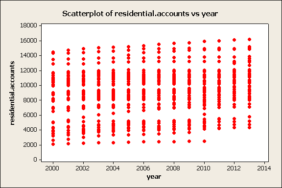

Textbook suggestions. All questions from from 11.1 to 11.42 are fine to practice ***except for***: 11.16(a), 11.17(b), 11.18(b), 11.19(b), 11.20, 11.21, 11.31, 11.32, 11.33, 11.35, 11.36(b), 11.37(b), 11.38(b), 11.40(b, c), 11.42.

We do not cover sections 11.9 and 11.10 at all. I may mention 11.10 material casually in class but you will not be responsible for it.

## F and R^2

First let's practice how the $F$ and $R^2$ business fits in with the rest of the numbers, with the data from question 11.49 from the book. Here is the usual regression output: 

```{r, echo=FALSE}
library(rio)
wc <- import("Ex11.49.txt")
summary(lm(lm(`Heart-Weight` ~ `Body-Weight`, data = wc)))
```

The $R^2$ value is after `Multiple R-squared:`.

Question: construct the ANOVA table for this regression analysis and verify that the $R^2$ value is as given.

## A question from a 2015 midterm

The City of Toronto is divided into 44 areas
called ``wards''. (Each ward elects one member to the City Council,
which is irrelevant to this question, but is mentioned to give you an
idea as to the meaning of ``ward''.)

The City of Toronto provides fresh water to its residents, who pay a
fee based on the amount of water used. Some residents of Toronto, such
as people who live in houses or condos, have
their own water account direct with the city. The accounts are called
``residential accounts.''

The City of Toronto published a dataset with the number of residential
accounts in each of the 44 wards for the 14 years from 2000 up to
2013. In other words, the sample size is `r 44*14`.

Here is a scatterplot of the data:



It will be inconvenient to work with numbers in the thousands, so I
divided those all the residential account count numbers by 1000 to
make a new variable called `residential.accounts.000`. Here is the
computer output from fitting the simple regression model with
`residential.accounts.000` as the response variable and
`year` as the input variable.

Some of the numbers have been obscured. For this dataset $S_{xx} = 10026.28$.

The output is not from R, but it is similar.

```
The regression equation is
residential.accounts.000 = ***************************

Predictor     Coef  SE Coef      T      P
Constant   -264.18    62.49  -4.23  0.000
year       *******  *******  *****  *****

S = 3.11591   R-Sq = ***%

Analysis of Variance

Source           DF       SS      MS      F      P
Regression      ***  *******  ******  *****  *****
Residual Error  ***  *******  ******
Total           ***  6146.85
```

1. Provide the missing entries for the Analysis of Variance table. Use the 0.05 and 0.01 tables for F distributions to estimate the p-value. You'll only be able to say one of "less than 0.01", "between 0.01 and 0.05", and "greater than 0.05" using those tables.

2. Estimate $\beta_1$ and perform the hypothesis test for
  $H_0:\beta_1=0$ versus $H_1:\beta_1\ne 0$ using a $t$ distribution
  and basing your conclusion on a p-value.
  
3. Can you now give a better estimate for the p-value from 1.?

4. $R^2$ is a measure of the ``strength'' of a linear
  model. Calculate its value in this case and explain how it is
  possible for $R^2$ to be so low and yet the slope parameter is also
  significantly different from 0.
  
5. Estimate the average number of thousands of residential water accounts for a City of Toronto ward for the year 2014. Produce a 95\% confidence interval for this estimate. 
  
6. Predict the number of thousands of residential water accounts in a randomly selected City of Toronto ward for the year 2014. Produce a 95\% prediction interval for this prediction. (We will revisit this question next week.)

7. The regression analysis using the original data (before dividing the counts of residential accounts by 1000) results in exactly the same p-values. Explain why.